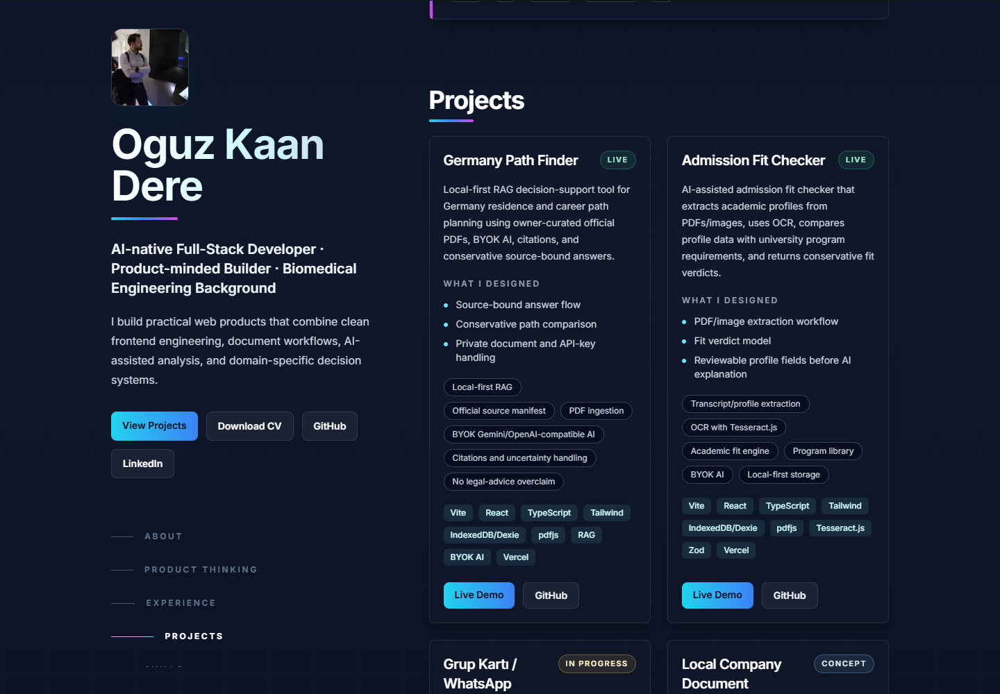

# Oguz Kaan Dere Portfolio

Personal portfolio for Oguz Kaan Dere, a product-minded full-stack developer with a Biomedical Engineering background and a current focus on AI-assisted, local-first web products.

Live demo: https://oguzdere.vercel.app/

## Screenshots




## Highlights

- Sticky dark intro panel with profile photo, CV, GitHub, and LinkedIn links
- Experience timeline covering AI product building, enterprise Angular work, hospital software, and Unity prototypes
- Project section with honest status badges for live, in-progress, concept, and portfolio work
- Product-thinking section focused on source-bound AI, local-first workflows, RAG, OCR, and decision-support tools

## Featured Projects

- Germany Path Finder - local-first RAG decision-support tool for Germany residence and career path planning
- Admission Fit Checker - OCR/PDF-based academic profile extraction and conservative university fit checks
- Grup Kartı / WhatsApp Group Analyzer - privacy-aware group report concept
- Local Company Document Assistant - local-first company PDF assistant concept
- Beni İşe Al - AI persuasion game concept

## Tech Stack

- Next.js
- React
- TypeScript
- Tailwind CSS
- Vercel

## Run Locally

```bash
npm install
npm run dev
```

Open http://localhost:3000.

## Build

```bash
npm run build
```

## Assets

The portfolio expects `public/profile-oguz.jpg` for the profile photo and `public/Oguz_Kaan_Dere_CV.pdf` for the CV download.

## Deployment

The site is configured for Vercel with the default Next.js build flow.
