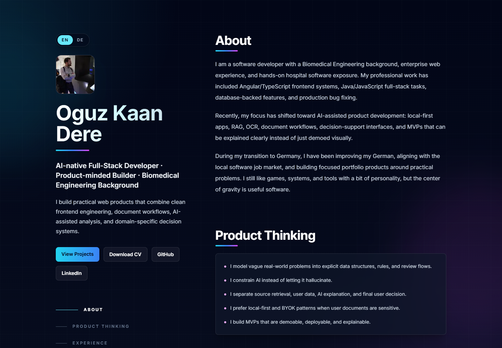
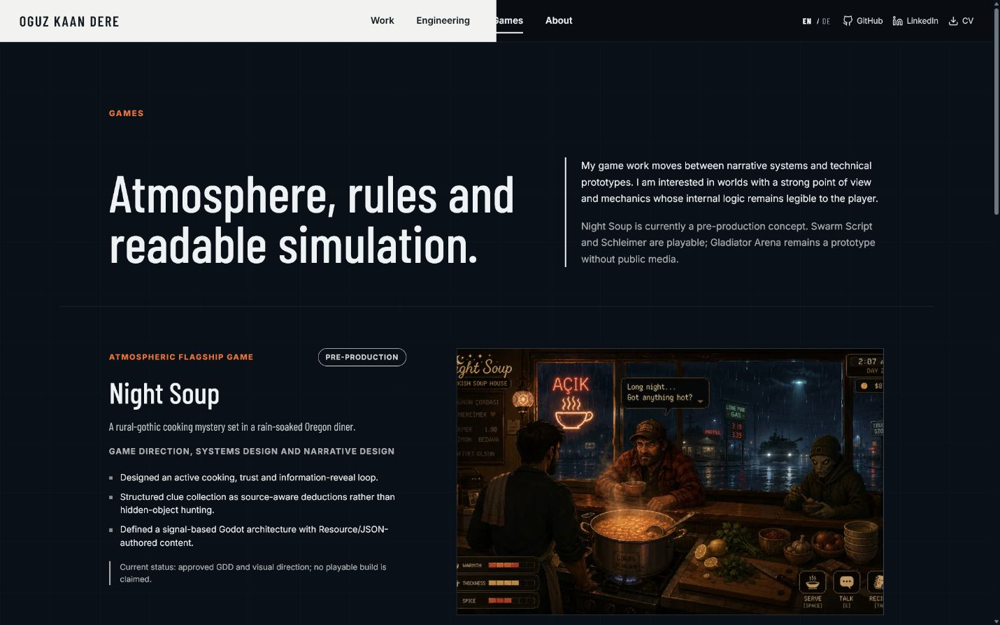

# Oguz Kaan Dere — Engineering & Games

Personal portfolio for [Oguz Kaan Dere](https://okdere.com), presenting software engineering, independent products, and technical game work through one bilingual site.

## Current portfolio story

- **LedgerFlow** — completed Java microservice case study with Kafka workflows, PostgreSQL service ownership, Redis, Keycloak, observability, a React operations console, documented production boundaries, and release/load-test planning
- **Tip Tracker** — proprietary native Android earnings product being prepared for Google Play, with a public recruiter-facing engineering showcase at [tip-tracker-showcase](https://github.com/ogzkaann/tip-tracker-showcase)
- **Frontend systems** — measured React architecture and WebGL-driven product work
- **AI-assisted products** — local-first RAG, OCR, document extraction, BYOK workflows, and explicit evidence-integrity design
- **Games** — Night Soup, Swarm Script, Gladiator Arena, and Schleimer
- **EN/DE** — locale-aware routes and professional English/German editorial content with `next-intl`

## Site structure

- **Work** — split Engineering/Games introduction and selected project overview
- **Engineering** — backend platforms, Android products, frontend architecture, and controlled AI workflows
- **Games** — narrative systems, deterministic simulations, and playable prototypes
- **About** — professional background, engineering principles, experience, and current working set

## Screenshots





## Stack

- Next.js App Router
- React and TypeScript
- Tailwind CSS with a focused global visual system
- `next-intl` for English and German content
- Vercel deployment

Project facts, status, stack, media, and links are centralized in `src/data/projects.ts`. Localized editorial content lives in `messages/en.json` and `messages/de.json`.

The Tip Tracker production repository remains private. The portfolio intentionally links to its public showcase repository, which contains product screenshots, architecture notes, engineering decisions, testing strategy, privacy details, and small illustrative code excerpts without exposing the proprietary source tree.

## Run locally

```bash
npm install
npm run dev
```

Quality checks:

```bash
npm run lint
npm run typecheck
npm run build
```

The site expects `public/profile-oguz.jpg` and `public/Oguz_Kaan_Dere_CV.pdf`. Production metadata, canonicals, sitemap, and robots target `https://okdere.com`.

## Deployment

Vercel uses npm and the standard Next.js production build configured in `vercel.json`.
